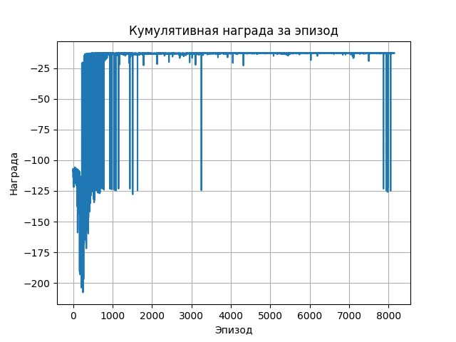

# Отчёт: Управление дроном в 2D-пространстве с использованием RL

## 1. Постановка задачи

Цель проекта — реализовать агента, который может управлять дроном в 2D-пространстве так, чтобы он:
- Поднимался в воздух,
- Стабилизировался и удерживался в определённой области,
- Успешно и безопасно приземлялся в целевой зоне.

Дрон должен избегать крушений, падений вне зоны и выходов за границы симуляции.

---

## 2. Мотивация использования RL

RL (обучение с подкреплением) применяется, поскольку:
- Динамика сложна для аналитического описания;
- Состояние среды непрерывное, но действия дискретные;
- Требуется адаптивная стратегия с учётом инерции, гравитации, углов;
- RL позволяет агенту учиться через пробу и ошибку, не имея заранее заданных правил.

---

## 3. Описание среды

Среда `Drone2DEnv` реализована на базе `gym.Env`.

### Наблюдения (состояние агента):
- `x, y` — координаты центра дрона
- `vx, vy` — скорости
- `угол` — текущая ориентация
- `угловая скорость`
- `контакт с землёй` (0/1)

### Действия:
- `0` — ничего
- `1` — толчок влево
- `2` — толчок вправо
- `3` — толчок вверх

### Награды:
- `-distance до цели` — мотивирует приблизиться к цели
- `-0.1 * abs(angle)` — штраф за крен
- `+10` — успешная посадка
- `-100` — крушение или выход за границы

---

## 4. Алгоритм обучения

Выбран алгоритм **Proximal Policy Optimization (PPO)**, реализованный в `Stable-Baselines3`.

- Политика: `MlpPolicy` с двумя скрытыми слоями по 128 нейронов
- Discount factor: `γ = 0.995`
- GAE λ: `0.9`
- Batch size: `128`
- Learning rate: `3e-4`
- Callback'и: чекпоинты и оценка модели

---

## 5. Эксперименты

### Процесс
- Агент обучается в течение 500k шагов.
- Каждые 50k — сохраняется чекпоинт.
- Логирование происходит через Monitor и TensorBoard.

### Наблюдения
- Агент сначала быстро падает.
- Со временем учится поднимать дрон, удерживать его, и только потом приземляться.
- Поведение нестабильно при обучении "с нуля", но можно дообучать с чекпоинтов.

---

## 6. Результаты

- **Итоговая модель** достигает положительной средней награды (>5).
- Агент успешно приземляется в большинстве эпизодов после 300k шагов.
- График награды показывает рост и стабилизацию.

---

## 7. Выводы и будущие улучшения

В ходе обучения наблюдается быстрое улучшение поведения агента на первых этапах. После примерно 1000 эпизодов агент стабильно демонстрирует хорошие результаты, поддерживая высокие значения кумулятивной награды. Однако периодически происходят резкие провалы, что указывает на наличие нестабильности в политике. Это может быть связано с разнообразием стартовых условий или недостаточной устойчивостью стратегии. В целом, тренд демонстрирует успешное обучение, но требует дальнейшей донастройки и анализа надёжности.

---
